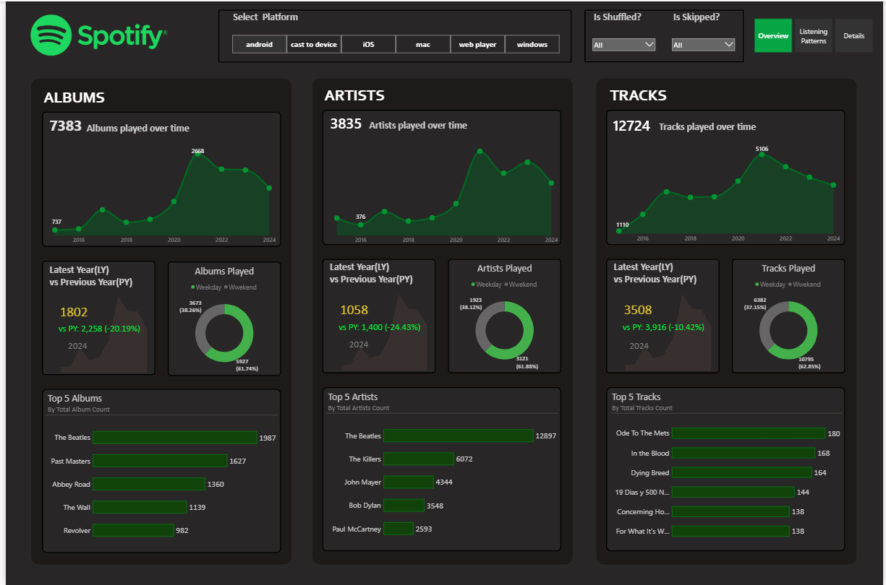
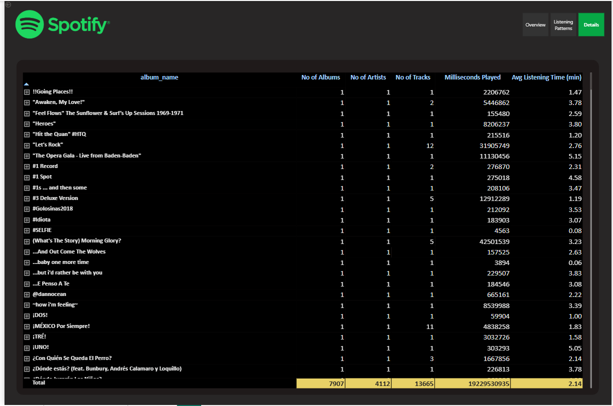

# Spotify Analysis Project

An interactive **Power BI dashboard** for analyzing Spotify listening history and exploring listening patterns across platforms, years, albums, artists, and tracks.

## 📊 Project Overview

This project uses Spotify listening history data to create an interactive Power BI dashboard.

The dashboard provides an overview of listening activity and allows users to explore:

* Albums played over time
* Artists played over time
* Tracks played over time
* Latest Year vs Previous Year comparison
* Weekday vs Weekend listening patterns
* Top 5 Albums
* Top 5 Artists
* Top 5 Tracks
* Platform-wise listening analysis
* Shuffled and skipped listening activity

## 🖥️ Dashboard Preview

### Overview



### Listening Patterns


### Details



## 📌 Dashboard Features

### Overview

The Overview page presents the main listening statistics, including:

* Total albums played
* Total artists played
* Total tracks played
* Albums played over time
* Artists played over time
* Tracks played over time
* Latest Year vs Previous Year comparison
* Weekday vs Weekend distribution
* Top 5 albums
* Top 5 artists
* Top 5 tracks

### Listening Patterns

The Listening Patterns page is used to explore listening activity and patterns using the available Spotify listening history data.

### Details

The Details page provides detailed information from the Spotify listening history dataset for further exploration.

## 🎛️ Interactive Filters

The dashboard includes interactive filters for:

* Platform
* Is Shuffled?
* Is Skipped?

These filters allow users to interact with the dashboard and explore the listening data based on different conditions.

## 🛠️ Tools & Technologies

* **Microsoft Power BI**
* **DAX**
* **Microsoft Excel**
* **CSV data**
* **Data visualization**

## 📂 Project Structure

```text
Spotify-Analysis-Project/
│
├── Spotify Dashboard/
│   └── Dashboard.pbix
│
├── Spotify Data/
│   └── Spotify Data/
│       ├── Read me.txt
│       ├── spotify_history.csv
│       └── spotify_history.xlsx
│
├── Spotify Analysis.pptx
├── Spotify Data Explaination.docx
├── Spotify_Logo_Final.png
│
├── Details.png
├── Listening Patterns.png
├── Overview.png
│
└── README.md
```

## 📁 Dataset

The project uses Spotify listening history data stored in:

* `spotify_history.csv`
* `spotify_history.xlsx`

The dataset is included inside the **Spotify Data** folder.

## ⚙️ How to Use

1. Download or clone this repository.
2. Open the `Dashboard.pbix` file from the **Spotify Dashboard** folder using Microsoft Power BI Desktop.
3. Ensure the required Spotify data files are available in the **Spotify Data** folder.
4. Open the dashboard and use the available interactive filters.
5. Explore the Overview, Listening Patterns, and Details pages.

## 🎯 Project Objective

The objective of this project is to transform Spotify listening history data into an interactive Power BI dashboard that makes listening activity and patterns easier to explore and understand.

## 👤 Author

**Ajeet Sharma**

GitHub: [ajeet-sharma-prog](https://github.com/ajeet-sharma-prog)

